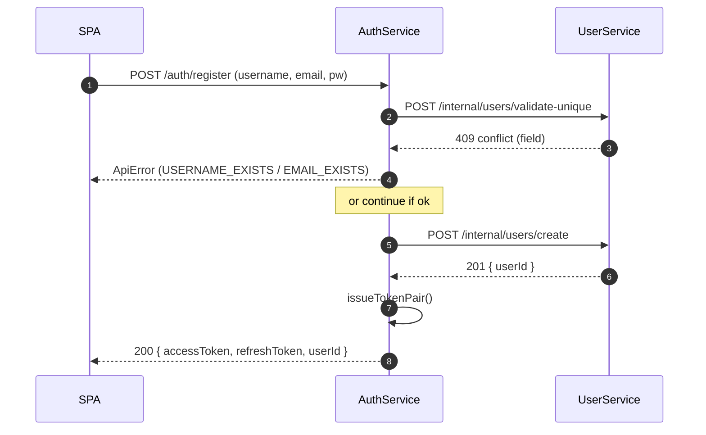
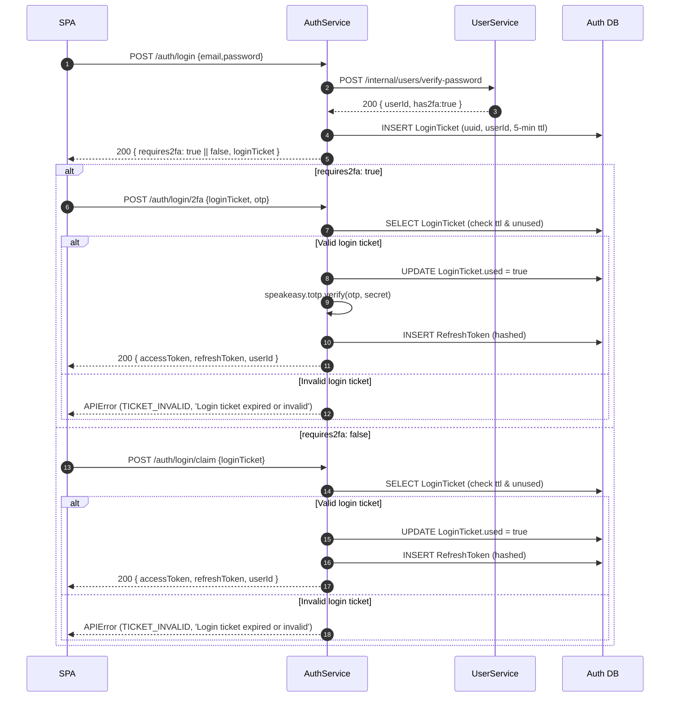
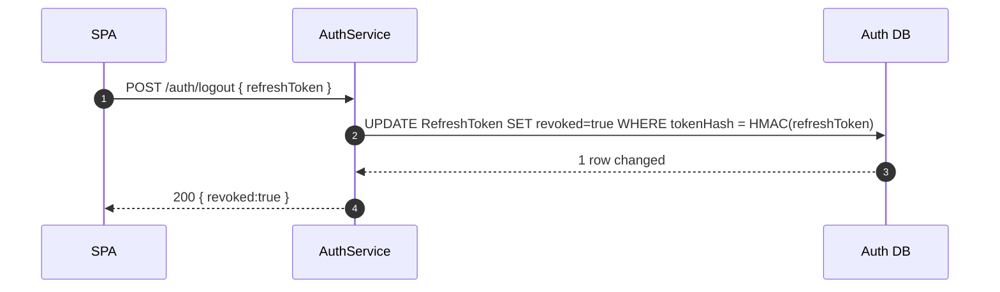
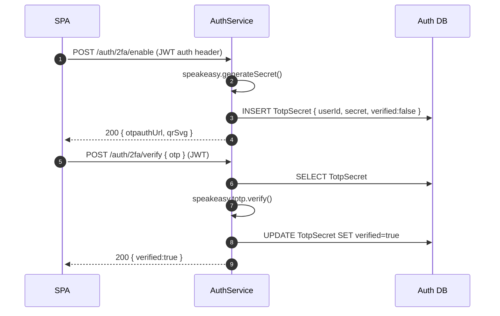
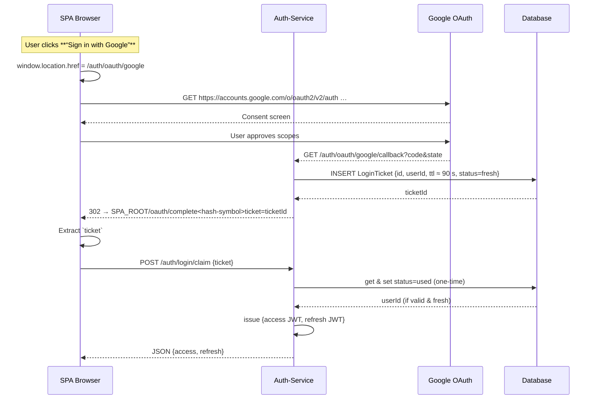

# AuthService – Technical Specification

**Edition v5 – 9 June 2025**
*(v1 → base, v2 → /auth/register, v3 → local schemas, v4 → UserService client & refined contracts → v5 Complete API reference + remove redundant sections)*

---

## 1 Overview

AuthService is a standalone **Fastify** microservice that provides:

* Email/Password authentication (password verification delegated to **UserService**)
* Google OAuth 2.0 login
* JWT access‑ & refresh‑token issuance/validation/rotation
* Optional TOTP‑based 2‑Factor Authentication for email/password logins
* SQLite persistence via **Prisma ORM**
* DTO contracts imported from **@KarenDanielyan/ft‑transcendence-api‑types**
* **Schema validation** via local **AJV** TypeScript schema objects (`src/schemas/*.schema.ts`)

---

## 2 Key Decisions

| Concern            | Decision                                      | Rationale                                          |
|--------------------|-----------------------------------------------|----------------------------------------------------|
| Data ownership     | No `password_hash` column                     | Single credential source in user-service           |
| External OAuth     | Google Sign‑in via **@fastify/oauth2**        | Familiar UX, minimal extra code                    |
| Contracts location | DTOs in **api‑types**, schemas local          | Keeps SRP; each service can swap AJV for Zod etc.  |
| ORM                | **Prisma Client + Prisma Migrate**            | Declarative schema, ergonomic API                  |
| DB                 | `auth.db` (SQLite)                            | Lightweight, container‑friendly                    |
| Internal comms     | REST/HTTP on Docker network                   | Aligns with global constraints                     |
| Internal auth      | Shared `X‑Cluster‑Token` header               | Simple and service‑agnostic. **Currently unsued**. |
| Rate‑limit & CSP   | **@fastify/rate-limit** + **@fastify/helmet** | Adequate for project scope                         |

---

## 3 Api Reference

### Table of Contents

1. [Health Check](#health-check)
2. [Authentication](#authentication)

* [Register](#register)
* [Login](#login)
* [Login with 2FA](#login-with-2fa)
* [Complete 2FA Login](#complete-2fa-login)
* [Refresh Tokens](#refresh-tokens)
* [Logout](#logout)
3. [Two-Factor Authentication](#two-factor-authentication)
* [Enable 2FA](#enable-2fa)
* [Verify 2FA OTP](#verify-2fa-otp)
4. [OAuth](#oauth)
* [Google OAuth2](#google-oauth2)
* [Google OAuth2 Callback](#google-oauth2-callback)
* [Google OAuth2 Claim](#google-oauth2-claim)
5. [Internal Endpoints](#internal-endpoints)
* [Verify JWT Token](#verify-jwt-token-internal)
* [Revoke Refresh Token](#revoke-refresh-token-internal)

---

### Health Check

| Method | Path    | Description           | Internal | Request | Response (200)       |
| ------ | ------- | --------------------- | -------- | ------- | -------------------- |
| GET    | /health | Health check endpoint | No       | –       | `{ "status": "ok" }` |

---

### Authentication

#### Register

**Registration Flow:**


| Method | Path           | Description       | Internal | Request Body                                               | Response (200)                                                 | Response (409)                                                                      |
| ------ | -------------- | ----------------- | -------- | ---------------------------------------------------------- | -------------------------------------------------------------- | ----------------------------------------------------------------------------------- |
| POST   | /auth/register | Register new user | No       | `{ "email": "...", "username": "...", "password": "..." }` | `{ "accessToken": "jwt", "refreshToken": "jwt", "userId": 1 }` | `{ "status": "error", "code": "EMAIL_EXISTS", "message": "E‑mail already in use" }` |

---

#### Login

Login is always a two-step process:
1. **Initial login**: with email/password, which may require 2FA.
2. **Check 2FA**: if required, the user must complete 2FA with a one-time password (OTP) sent to their authenticator app.
2. **Complete login**: In both cases, a login ticket is issued to prevent replay attacks. In case of 2FA, the ticket is used to verify the OTP. Otherwise, the ticket is claimed via `/auth/login/claim`.
3. **Refresh tokens**: are issued alongside access tokens for session management.

**Login Flow:**

#### Begin Login

| Method | Path        | Description               | Internal | Request Body                            | Response (200)                                     | Response (401)                                                                                   |
|--------|-------------|---------------------------|----------|-----------------------------------------|----------------------------------------------------|--------------------------------------------------------------------------------------------------|
| POST   | /auth/login | Login with email/password | No       | `{ "email": "...", "password": "..." }` | `{ "requires2fa": "bool", "loginTicket": "uuid" }` | `{ "status": "error", "code": "INVALID_CREDENTIALS", "message": "Email or password incorrect" }` |

---

#### Complete 2FA Login

| Method | Path            | Description                      | Internal | Request Body                                 | Response (200)                                                 | Response (401)                                                                                  |
|--------|-----------------|----------------------------------|----------|----------------------------------------------|----------------------------------------------------------------|-------------------------------------------------------------------------------------------------|
| POST   | /auth/login/2fa | Complete login with OTP & ticket | No       | `{ "loginTicket": "uuid", "otp": "123456" }` | `{ "accessToken": "jwt", "refreshToken": "jwt", "userId": 1 }` | `{ "status": "error", "code": "TICKET_INVALID", "message": "Login ticket invalid or expired" }` |

#### Claim Login Ticket

| Method | Path              | Description                        | Internal | Request Body                | Response (200)                                                 | Response (401)                                                                                        | Response (501)                                                                       |
|--------|-------------------|------------------------------------|----------|-----------------------------|----------------------------------------------------------------|-------------------------------------------------------------------------------------------------------|--------------------------------------------------------------------------------------|
| POST   | /auth/login/claim | Claim tokens using a login ticket. | No       | `{ "loginTicket": "uuid" }` | `{ "accessToken": "jwt", "refreshToken": "jwt", "userId": 1 }` | `{ "status": "error", "code": "INVALID_LOGIN_TICKET", "message": "Login ticket invalid or expired" }` | `{ "status": "error", "code": "CLAIM_FAILED", "message": "Failed to claim tokens" }` |

---

#### Rotate Tokens

| Method | Path          | Description                   | Internal | Request Body                | Response (200)                                                 | Response (401)                                                                                    |
|--------|---------------|-------------------------------|----------|-----------------------------|----------------------------------------------------------------|---------------------------------------------------------------------------------------------------|
| POST   | /auth/refresh | Refresh access/refresh tokens | No       | `{ "refreshToken": "jwt" }` | `{ "accessToken": "jwt", "refreshToken": "jwt", "userId": 1 }` | `{ "status": "error", "code": "INVALID_REFRESH", "message": "Refresh token invalid or expired" }` |

---

#### Logout

**Logout Flow:**


| Method | Path         | Description             | Internal | Request Body                | Response (200)        | Response (404)                                                                                              |
|--------|--------------|-------------------------|----------|-----------------------------|-----------------------|-------------------------------------------------------------------------------------------------------------|
| POST   | /auth/logout | Logout and revoke token | No       | `{ "refreshToken": "jwt" }` | `{ "revoked": true }` | `{ "status": "error", "code": "TOKEN_NOT_FOUND", "message": "Refresh token not found or already revoked" }` |

---

### Enable Two-Factor Authentication (2FA)

**Enable 2FA Flow:**


#### Enable 2FA

| Method | Path             | Description         | Internal | Request Headers                 | Response (200)                                                 |
|--------|------------------|---------------------|----------|---------------------------------|----------------------------------------------------------------|
| POST   | /auth/2fa/enable | Enable 2FA for user | No       | `Authorization: Bearer <token>` | `{ "otpauthUrl": "otpauth://...", "qrSvg": "<svg>...</svg>" }` |

---

#### Verify 2FA OTP

| Method | Path             | Description         | Internal | Request Headers                 | Request Body          | Response (200)         | Response (400)                                                                   | Response (401)                                                           |
|--------|------------------|---------------------|----------|---------------------------------|-----------------------|------------------------|----------------------------------------------------------------------------------|--------------------------------------------------------------------------|
| POST   | /auth/2fa/verify | Verify 2FA for user | No       | `Authorization: Bearer <token>` | `{ "otp": "123456" }` | `{ "verified": true }` | `{ "status": "error", "code": "2FA_NOT_ENABLED", "message": "2FA not enabled" }` | `{ "status": "error", "code": "OTP_INVALID", "message": "Invalid OTP" }` |

---

### OAuth

**Google OAuth2 Flow:**

#### Google OAuth2
| Method | Path               | Description         | Internal | Request Headers | Response (200)                            | Response (500)                                                                         |
|--------|--------------------|---------------------|----------|-----------------|-------------------------------------------|----------------------------------------------------------------------------------------|
| GET    | /auth/oauth/google | Start Google OAuth2 | No       | –               | 302 Redirect to Google OAuth consent page | `{ "status": "error", "code": "OAUTH_FAILED", "message": "Google OAuthTypes failed" }` |

#### Google OAuth2 Callback
| Method | Path                        | Description                                                                                                      | Internal | Request Headers | Response (302)                        | Response (500)                                                                         |
|--------|-----------------------------|------------------------------------------------------------------------------------------------------------------|----------|-----------------|---------------------------------------|----------------------------------------------------------------------------------------|
| GET    | /auth/oauth/google/callback | Google OAuth2 callback. Handles Google login, creates user if needed, issues login ticket, and redirects to SPA. | No       | –               | 302 Redirect to SPA with login ticket | `{ "status": "error", "code": "OAUTH_FAILED", "message": "Google OAuthTypes failed" }` |

---
### Internal Endpoints

#### Verify JWT Token (Internal)

| Method | Path                    | Description      | Internal | Request Headers (unused)   | Request Body         | Response (200)                       | Response (401)                                                                          | Response (403)                                                                      | Response (404)                                                                 |
|--------|-------------------------|------------------|----------|----------------------------|----------------------|--------------------------------------|-----------------------------------------------------------------------------------------|-------------------------------------------------------------------------------------|--------------------------------------------------------------------------------|
| POST   | /internal/tokens/verify | Verify JWT token | Yes      | `X-Cluster-Token: <token>` | `{ "token": "jwt" }` | `{ "userId": 1, "username": "foo" }` | `{ "status": "error", "code": "INVALID_TOKEN", "message": "Token invalid or expired" }` | `{ "status": "error", "code": "FORBIDDEN", "message": "Internal route forbidden" }` | `{ "status": "error", "code": "USER_NOT_FOUND", "message": "User not found" }` |

---

#### Revoke Refresh Token (Internal)

| Method | Path                    | Description                  | Internal | Request Headers (unused)   | Request Body                           | Response (200)        | Response (404)                                                                           |
|--------|-------------------------|------------------------------|----------|----------------------------|----------------------------------------|-----------------------|------------------------------------------------------------------------------------------|
| POST   | /internal/tokens/revoke | Revoke a refresh token by ID | Yes      | `X-Cluster-Token: <token>` | `{ "tokenId": "refresh-token-db-id" }` | `{ "revoked": true }` | `{ "status": "error", "code": "TOKEN_NOT_FOUND", "message": "Refresh token not found" }` |

---

### Error Envelope Format

For error responses, the following envelope is used unless otherwise specified:

```json
{
	"status": "error",
	"code": "ERROR_CODE",   // Optional, machine-readable code (e.g. "EMAIL_EXISTS")
	"message": "Description of error"
}
```

---

### Notes

* **Internal**: Internal endpoints are for service-to-service use only (require `X-Cluster-Token` header).
* **Authorization**: Some endpoints require `Authorization: Bearer <token>`.
* **HTTP Status Codes**: Standard usage (200, 400, 401, 403, 404, 409, 500).

---

## 4 Shared Types & Validation

* **DTO definitions** live in `@KarenDanielyan/ft-transcendence-api-types` and are imported with:

  ```ts
  import { Auth } from '@KarenDanielyan/ft-transcendence-api-types';
  ```
* **Runtime validation** uses one AJV instance registered by `plugins/validation.ts`.

  ```ts
  app.setValidatorCompiler(({ schema }) => ajv.compile(schema));
  ```

The plugin loads every `*Schema.ts` file under `src/schemas` and registers its `default` export (`$id` must be unique).
* **Strict mode** – `additionalProperties: false`, coercion off, built‑in `format` keywords via `ajv-formats`.
* **Error handler** – any thrown `ApiError` passes through the global handler which serialises `{ status:'error', code, message }`.

---

## 5 Database Schema (Prisma)

```prisma
// prisma/schema.prisma

datasource db {
  provider = "sqlite"
  url      = env("DATABASE_URL")
}

generator client {
  provider = "prisma-client-js"
}

model RefreshToken {
  id            String   @id @default(cuid())
  userId        Int
  tokenHash     String
  expiresAt     DateTime
  createdAt     DateTime @default(now())
  rotatedAt     DateTime?
  revoked       Boolean  @default(false)
  revokedReason String?
}

model TotpSecret {
  id        String   @id @default(cuid())
  userId    Int      @unique
  secret    String   // base32
  verified  Boolean  @default(false)
  createdAt DateTime @default(now())
  updatedAt DateTime @updatedAt
}

model OAuthAccount {
  id             String   @id @default(cuid())
  provider       String
  providerUserId String
  email          String
  userId         Int
  createdAt      DateTime @default(now())

  @@unique([provider, providerUserId])
}

model LoginTicket {
  id        String   @id                // UUID v4
  userId    Int
  expiresAt DateTime
  used      Boolean  @default(false)
  createdAt DateTime @default(now())

  @@index([userId])
  @@index([expiresAt])
}
```
---

## 6 Environment Variables

| Var                         | Purpose                      | Example                                       |
|-----------------------------|------------------------------|-----------------------------------------------|
| `DATABASE_URL`              | SQLite file path             | `file:./auth.db`                              |
| `JWT_SECRET`                | HMAC key for access tokens   | *32‑byte base64*                              |
| `REFRESH_TOKEN_SALT`        | HMAC salt for refresh tokens | *32‑byte base64*                              |
| `CLUSTER_TOKEN`             | Internal service auth        | `d4c3…`                                       |
| `GOOGLE_CLIENT_ID`/`SECRET` | OAuth creds                  | *from GCP console*                            |
| `GOOGLE_CALLBACK_URL`       | OAuth redirect URL           | `http://localhost:3000/auth/oauth/google/callback` |
| `SPA_OAUTH_ROUTE`         | SPA OAuth complete route     | `http://localhost/oauth/complete`             |

---

## 7 Changelog

| Date        | Version | Notes                                                                                                      |
|-------------|---------|------------------------------------------------------------------------------------------------------------|
| 9 June 2025 | v5      | Remove redundant sections, complete API reference, update 2FA flow.                                        |
| 28 May 2025 | v5      | Complete API reference                                                                                     |
| 25 May 2025 | v4      | Register refactor, `username` uniqueness, login‑ticket model, UserService contracts, spec styling fixes.   |
| 24 May 2025 | v3      | Local schemas moved to `src/schemas`, AJV auto‑loader.                                                     |
| 23 May 2025 | v2      | Added `/auth/register` endpoint contracts.                                                                 |
| 22 May 2025 | v1      | Initial AuthService spec (login, refresh, OAuth, 2FA).                                                     |
