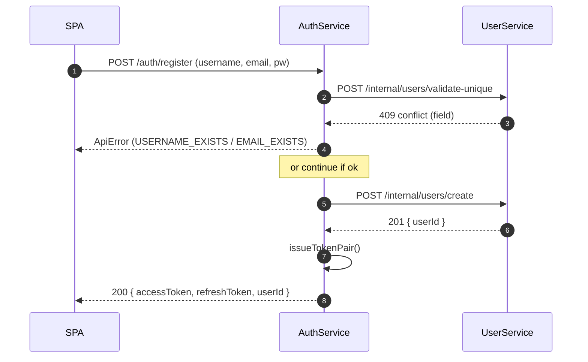
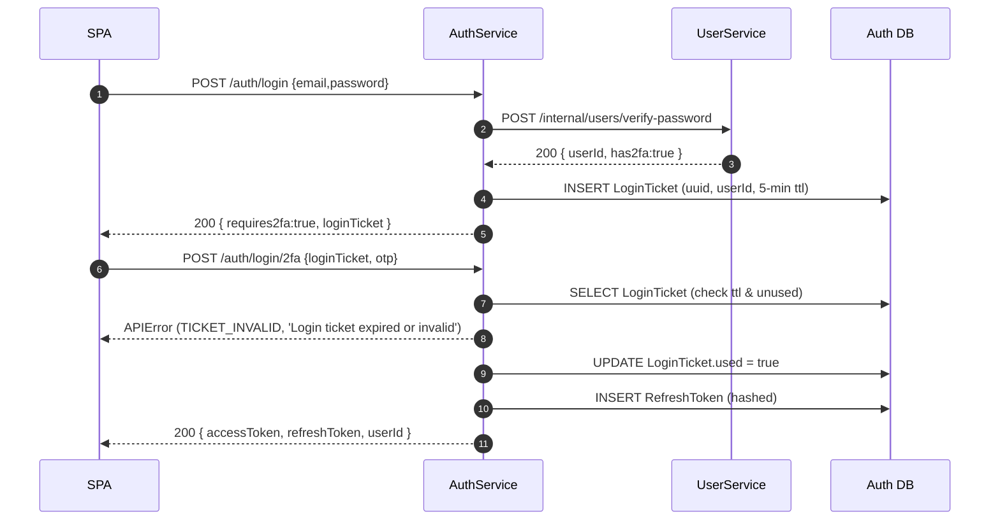
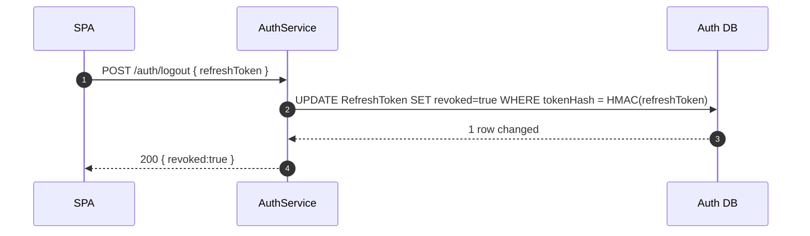
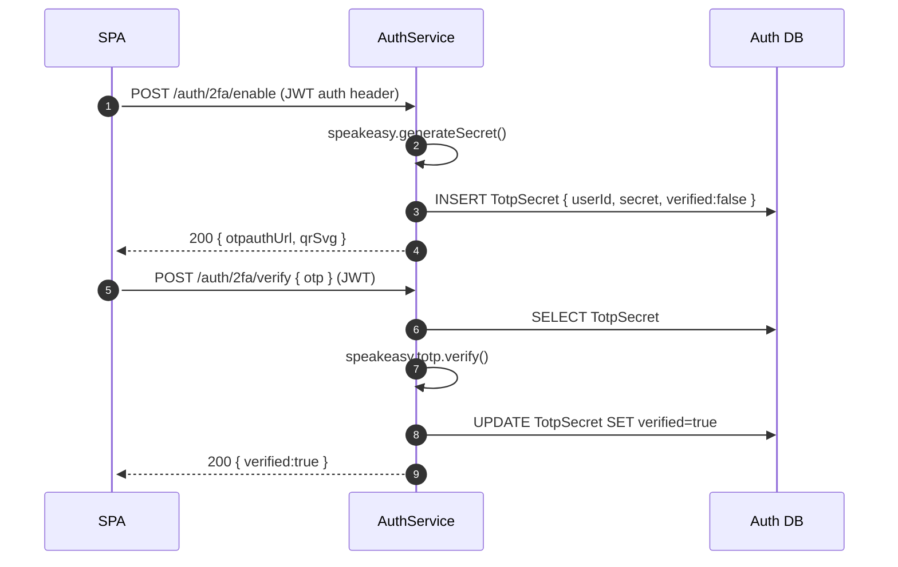
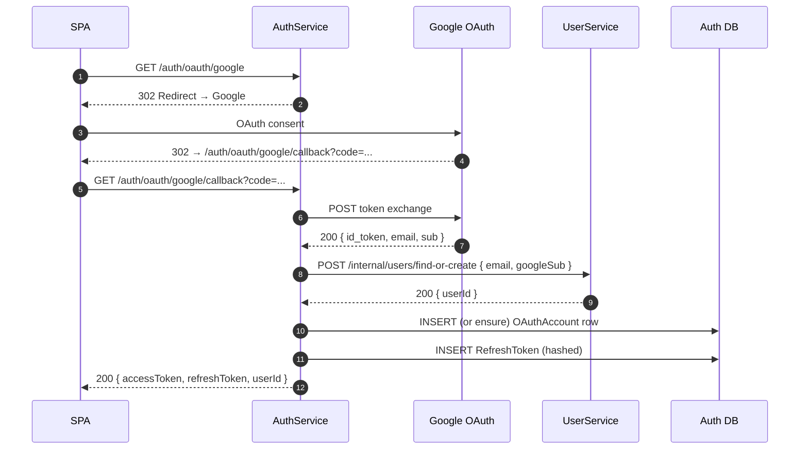

# AuthService – Technical Specification

**Edition v4 – 25 May 2025**
*(v1 → base, v2 → /auth/register, v3 → local schemas, v4 → UserService client & refined contracts)*

---

## 1 Overview

AuthService is a standalone **Fastify** microservice that provides:

* Email/Password authentication (password verification delegated to **UserService**)
* Google OAuth 2.0 login
* JWT access‑ & refresh‑token issuance/validation/rotation
* Optional TOTP‑based 2‑Factor Authentication for email/password logins
* SQLite persistence via **Prisma ORM**
* DTO contracts imported from **@ft‑transcendence/api‑types**
* **Schema validation** via local **AJV** TypeScript schema objects (`src/schemas/*.schema.ts`)

---

## 2 Key Decisions

| Concern            | Decision                                      | Rationale                                         |
|--------------------|-----------------------------------------------|---------------------------------------------------|
| Data ownership     | No `password_hash` column                     | Single credential source in UserService           |
| External OAuth     | Google Sign‑in via **@fastify/oauth2**        | Familiar UX, minimal extra code                   |
| Contracts location | DTOs in **api‑types**, schemas local          | Keeps SRP; each service can swap AJV for Zod etc. |
| ORM                | **Prisma Client + Prisma Migrate**            | Declarative schema, ergonomic API                 |
| DB                 | `auth.db` (SQLite)                            | Lightweight, container‑friendly                   |
| Internal comms     | REST/HTTP on Docker network                   | Aligns with global constraints                    |
| Internal auth      | Shared `X‑Cluster‑Token` header               | Simple and service‑agnostic                       |
| Rate‑limit & CSP   | **@fastify/rate-limit** + **@fastify/helmet** | Adequate for project scope                        |

---

## 3 Api Reference

### Table of Contents

1. [Health Check](#health-check)
2. [Authentication](#authentication)

  * [Register](#register)
  * [Login](#login)
  * [Login with 2FA](#login-with-2fa)
  * [Complete 2FA Login](#complete-2fa-login)
  * [Refresh Tokens](#refresh-tokens)
  * [Logout](#logout)
3. [Two-Factor Authentication](#two-factor-authentication)

  * [Enable 2FA](#enable-2fa)
  * [Verify 2FA OTP](#verify-2fa-otp)
4. [OAuth](#oauth)

  * [Google OAuth2 Callback](#google-oauth2-callback)
5. [Internal Endpoints](#internal-endpoints)

  * [Verify JWT Token](#verify-jwt-token-internal)
  * [Revoke Refresh Token](#revoke-refresh-token-internal)

---

### Health Check

| Method | Path    | Description           | Internal | Request | Response (200)       |
| ------ | ------- | --------------------- | -------- | ------- | -------------------- |
| GET    | /health | Health check endpoint | No       | –       | `{ "status": "ok" }` |

---

### Authentication

#### Register

| Method | Path           | Description       | Internal | Request Body                                               | Response (200)                                                 | Response (409)                                                                      |
| ------ | -------------- | ----------------- | -------- | ---------------------------------------------------------- | -------------------------------------------------------------- | ----------------------------------------------------------------------------------- |
| POST   | /auth/register | Register new user | No       | `{ "email": "...", "username": "...", "password": "..." }` | `{ "accessToken": "jwt", "refreshToken": "jwt", "userId": 1 }` | `{ "status": "error", "code": "EMAIL_EXISTS", "message": "E‑mail already in use" }` |

---

#### Login

| Method | Path        | Description               | Internal | Request Body                            | Response (200)                                                 | Response (200-alt)                               | Response (401)                                                                                   |
| ------ | ----------- | ------------------------- | -------- | --------------------------------------- | -------------------------------------------------------------- | ------------------------------------------------ | ------------------------------------------------------------------------------------------------ |
| POST   | /auth/login | Login with email/password | No       | `{ "email": "...", "password": "..." }` | `{ "accessToken": "jwt", "refreshToken": "jwt", "userId": 1 }` | `{ "requires2fa": true, "loginTicket": "uuid" }` | `{ "status": "error", "code": "INVALID_CREDENTIALS", "message": "Email or password incorrect" }` |

---

#### Complete 2FA Login

| Method | Path            | Description                      | Internal | Request Body                                 | Response (200)                                                 | Response (401)                                                                                  |
| ------ | --------------- | -------------------------------- | -------- | -------------------------------------------- | -------------------------------------------------------------- | ----------------------------------------------------------------------------------------------- |
| POST   | /auth/login/2fa | Complete login with OTP & ticket | No       | `{ "loginTicket": "uuid", "otp": "123456" }` | `{ "accessToken": "jwt", "refreshToken": "jwt", "userId": 1 }` | `{ "status": "error", "code": "TICKET_INVALID", "message": "Login ticket invalid or expired" }` |

---

#### Refresh Tokens

| Method | Path          | Description                   | Internal | Request Body                | Response (200)                                                 | Response (401)                                                                                    |
| ------ | ------------- | ----------------------------- | -------- | --------------------------- | -------------------------------------------------------------- | ------------------------------------------------------------------------------------------------- |
| POST   | /auth/refresh | Refresh access/refresh tokens | No       | `{ "refreshToken": "jwt" }` | `{ "accessToken": "jwt", "refreshToken": "jwt", "userId": 1 }` | `{ "status": "error", "code": "INVALID_REFRESH", "message": "Refresh token invalid or expired" }` |

---

#### Logout

| Method | Path         | Description             | Internal | Request Body                | Response (200)        | Response (404)                                                                                              |
| ------ | ------------ | ----------------------- | -------- | --------------------------- | --------------------- | ----------------------------------------------------------------------------------------------------------- |
| POST   | /auth/logout | Logout and revoke token | No       | `{ "refreshToken": "jwt" }` | `{ "revoked": true }` | `{ "status": "error", "code": "TOKEN_NOT_FOUND", "message": "Refresh token not found or already revoked" }` |

---

### Two-Factor Authentication

#### Enable 2FA

| Method | Path             | Description         | Internal | Request Headers                 | Response (200)                                                 |
| ------ | ---------------- | ------------------- | -------- | ------------------------------- | -------------------------------------------------------------- |
| POST   | /auth/2fa/enable | Enable 2FA for user | No       | `Authorization: Bearer <token>` | `{ "otpauthUrl": "otpauth://...", "qrSvg": "<svg>...</svg>" }` |

---

#### Verify 2FA OTP

| Method | Path             | Description         | Internal | Request Headers                 | Request Body          | Response (200)         | Response (400)                                                                   | Response (401)                                                           |
| ------ | ---------------- | ------------------- | -------- | ------------------------------- | --------------------- | ---------------------- | -------------------------------------------------------------------------------- | ------------------------------------------------------------------------ |
| POST   | /auth/2fa/verify | Verify 2FA for user | No       | `Authorization: Bearer <token>` | `{ "otp": "123456" }` | `{ "verified": true }` | `{ "status": "error", "code": "2FA_NOT_ENABLED", "message": "2FA not enabled" }` | `{ "status": "error", "code": "OTP_INVALID", "message": "Invalid OTP" }` |

---

### OAuth

#### Google OAuth2 Callback

| Method | Path                        | Description            | Internal | Request | Response (200)                                                 | Response (500)                                                                         |
| ------ | --------------------------- | ---------------------- | -------- | ------- | -------------------------------------------------------------- | -------------------------------------------------------------------------------------- |
| GET    | /auth/oauth/google/callback | Google OAuth2 callback | No       | –       | `{ "accessToken": "jwt", "refreshToken": "jwt", "userId": 1 }` | `{ "status": "error", "code": "OAUTH_FAILED", "message": "Google OAuthTypes failed" }` |

---

### Internal Endpoints

#### Verify JWT Token (Internal)

| Method | Path                    | Description      | Internal | Request Headers            | Request Body         | Response (200)                       | Response (401)                                                                          | Response (403)                                                                      | Response (404)                                                                 |
| ------ | ----------------------- | ---------------- | -------- | -------------------------- | -------------------- | ------------------------------------ | --------------------------------------------------------------------------------------- | ----------------------------------------------------------------------------------- | ------------------------------------------------------------------------------ |
| POST   | /internal/tokens/verify | Verify JWT token | Yes      | `X-Cluster-Token: <token>` | `{ "token": "jwt" }` | `{ "userId": 1, "username": "foo" }` | `{ "status": "error", "code": "INVALID_TOKEN", "message": "Token invalid or expired" }` | `{ "status": "error", "code": "FORBIDDEN", "message": "Internal route forbidden" }` | `{ "status": "error", "code": "USER_NOT_FOUND", "message": "User not found" }` |

---

#### Revoke Refresh Token (Internal)

| Method | Path                    | Description                  | Internal | Request Headers            | Request Body                           | Response (200)        | Response (404)                                                                           |
| ------ | ----------------------- | ---------------------------- | -------- | -------------------------- | -------------------------------------- | --------------------- | ---------------------------------------------------------------------------------------- |
| POST   | /internal/tokens/revoke | Revoke a refresh token by ID | Yes      | `X-Cluster-Token: <token>` | `{ "tokenId": "refresh-token-db-id" }` | `{ "revoked": true }` | `{ "status": "error", "code": "TOKEN_NOT_FOUND", "message": "Refresh token not found" }` |

---

### Error Envelope Format

For error responses, the following envelope is used unless otherwise specified:

```json
{
  "status": "error",
  "code": "ERROR_CODE",   // Optional, machine-readable code (e.g. "EMAIL_EXISTS")
  "message": "Description of error"
}
```

---

### Notes

* **Internal**: Internal endpoints are for service-to-service use only (require `X-Cluster-Token` header).
* **Authorization**: Some endpoints require `Authorization: Bearer <token>`.
* **HTTP Status Codes**: Standard usage (200, 400, 401, 403, 404, 409, 500).

---

## 4 Shared Types & Validation

* **DTO definitions** live in `packages/api-types/src/auth-types.ts` and are imported with:

  ```ts
  import { Auth } from '@KarenDanielyan/ft-transcendence-api-types';
  ```
* **Runtime validation** uses one AJV instance registered by `plugins/validation.ts`.

  ```ts
  app.setValidatorCompiler(({ schema }) => ajv.compile(schema));
  ```

  The plugin auto‑loads every `*Schema.ts` file under `src/schemas` and registers its `default` export (`$id` must be unique).
* **Strict mode** – `additionalProperties: false`, coercion off, built‑in `format` keywords via `ajv-formats`.
* **Error handler** – any thrown `ApiError` passes through the global handler which serialises `{ status:'error', code, message }`.

---

## 5 Database Schema (Prisma)

```prisma
// prisma/schema.prisma

datasource db {
  provider = "sqlite"
  url      = env("DATABASE_URL")
}

generator client {
  provider = "prisma-client-js"
}

model RefreshToken {
  id            String   @id @default(cuid())
  userId        Int
  tokenHash     String
  expiresAt     DateTime
  createdAt     DateTime @default(now())
  rotatedAt     DateTime?
  revoked       Boolean  @default(false)
  revokedReason String?
}

model TotpSecret {
  id        String   @id @default(cuid())
  userId    Int      @unique
  secret    String   // base32
  verified  Boolean  @default(false)
  createdAt DateTime @default(now())
  updatedAt DateTime @updatedAt
}

model OAuthAccount {
  id             String   @id @default(cuid())
  provider       String
  providerUserId String
  email          String
  userId         Int
  createdAt      DateTime @default(now())

  @@unique([provider, providerUserId])
}

model LoginTicket {
  id        String   @id                // UUID v4
  userId    Int
  expiresAt DateTime
  used      Boolean  @default(false)
  createdAt DateTime @default(now())

  @@index([userId])
  @@index([expiresAt])
}
```
---

## 6 AuthService ↔ UserService Internal Contracts

| Purpose                          | HTTP call                              | Payload                           | Success                                  | Error mapping                    |
|----------------------------------|----------------------------------------|-----------------------------------|------------------------------------------|----------------------------------|
| Password verification            | `POST /internal/users/verify-password` | `{ email, password }`             | `{ userId }`                             | `INVALID_CREDENTIALS`            |

All requests must include header `X‑Cluster‑Token: <CLUSTER_TOKEN>`.

---

## 7 Sequence Diagram

### Register Flow


### Login Flow

### Logout Flow

### Enable 2FA Flow

### Google OAuth Flow

---

## 8 Migrations & Dev Workflow

| Step               | Command                                                 |
|--------------------|---------------------------------------------------------|
| Edit Prisma models | *edit* `prisma/schema.prisma`                           |
| Create migration   | `npx prisma migrate dev --name <change>`                |
| Generate client    | `npx prisma generate` (auto‑run by migrate)             |
| Reset DB (dev)     | `npm run db:reset` (wrapper for `prisma migrate reset`) |

The Docker build runs `prisma migrate deploy` so containers always start with latest schema.

---

## 9 Environment Variables

| Var                         | Purpose                      | Example                                            |
|-----------------------------|------------------------------|----------------------------------------------------|
| `DATABASE_URL`              | SQLite file path             | `file:./auth.db`                                   |
| `JWT_SECRET`                | HMAC key for access tokens   | *32‑byte base64*                                   |
| `REFRESH_TOKEN_SALT`        | HMAC salt for refresh tokens | *32‑byte base64*                                   |
| `CLUSTER_TOKEN`             | Internal service auth        | `d4c3…`                                            |
| `GOOGLE_CLIENT_ID`/`SECRET` | OAuth creds                  | *from GCP console*                                 |
| `GOOGLE_CALLBACK_URL`       | OAuth redirect URL           | `http://localhost:3000/auth/oauth/google/callback` |

---

## 10  Dependencies

```jsonc
"dependencies": {
  "@fastify/jwt": "^6",
  "@fastify/helmet": "^9",
  "@fastify/rate-limit": "^7",
  "@fastify/oauth2": "^8",
  "@KarenDanielyan/ft-transcendence-api-types": "*",
  "@prisma/client": "^5",
  "ajv": "^8",
  "ajv-formats": "^2",
  "fastify": "^4",
  "speakeasy": "^3"
},
"devDependencies": {
  "prisma": "^5",
  "ts-node-dev": "^3",
  "typescript": "^5",
  "vitest": "^1"
}
```

---

## 11 Local `.env` Setup & Generator

### 11.1 Minimal template

Create `backend/authservice/.env` with **at least** the following variables:

```env
DATABASE_URL=file:./auth.db
JWT_SECRET=<32‑byte‑base64>
REFRESH_TOKEN_SALT=<32‑byte‑base64>
CLUSTER_TOKEN=<hex16>

# Google OAuth
GOOGLE_CLIENT_ID=
GOOGLE_CLIENT_SECRET=
GOOGLE_CALLBACK_URL=http://localhost:3000/auth/oauth/google/callback
```

### 11.2 Automatic generator (script)

Add `scripts/generate-env.sh`:

```bash
#!/usr/bin/env bash
set -euo pipefail
JWT_SECRET=$(openssl rand -base64 32)
REFRESH_TOKEN_SALT=$(openssl rand -base64 32)
CLUSTER_TOKEN=$(openssl rand -hex 16)
cat > backend/auth-service/.env <<EOF
DATABASE_URL=file:./auth.db
JWT_SECRET=$JWT_SECRET
REFRESH_TOKEN_SALT=$REFRESH_TOKEN_SALT
CLUSTER_TOKEN=$CLUSTER_TOKEN

# Google OAuth
GOOGLE_CLIENT_ID=
GOOGLE_CLIENT_SECRET=
GOOGLE_CALLBACK_URL=http://localhost:3000/auth/oauth/google/callback
EOF
echo ".env generated — fill in Google creds."
```

Expose via npm:

```jsonc
"scripts": {
  "init:env": "bash scripts/generate-env.sh"
}
```

Run `npm run init:env` once per dev machine.

---

## 12  Google OAuth Setup Guide

1. **Create / select a project** in [https://console.cloud.google.com/](https://console.cloud.google.com/).
2. **OAuth consent screen** → *External* → fill app info, add scopes `openid`, `email`, `profile`.
3. **Credentials → Create OAuth client ID** → *Web application*.
4. Add **Authorized redirect URI**: `http://localhost:3000/auth/oauth/google/callback`.
5. Copy **Client ID** and **Client Secret** into `.env`.
6. Rebuild / restart AuthService.

> For production, create a separate OAuth client and mount a different `.env.prod` file.

---

## 13  Docker Build & Run

### 13.1 CLI build

```bash
# from repo root
docker build -f backend/auth-service/Dockerfile -t ft-auth-service:latest .
```

Run:

```bash
docker run --rm -p 3000:3000 --env-file backend/auth-service/.env ft-auth-service:latest
```

### 13.2 docker‑compose snippet

```yaml
authservice:
  build:
    context: .
    dockerfile: backend/auth-service/Dockerfile
  env_file: backend/auth-service/.env
  ports:
    - "3000:3000"
```

> **Why root context?** Dockerfile copies `package.json` from the monorepo root and `packages/api-types/**`—those paths are outside `backend/authservice/`.

---

## 14 Open Questions / Future Work

* **Refresh‑token family trees** (token‑reuse detection) – skipped for MVP.
* **Argon2 vs HMAC** – revisit after security review; add PBKDF benchmarking.
* **Audit logging** – optionally emit auth events to centralized log.
* **Account lockout / brute‑force protection** – consider incremental back‑off.

---

## 15 Changelog

| Date        | Version | Notes                                                                                                    |
|-------------|---------|----------------------------------------------------------------------------------------------------------|
| 28 May 2025 | v5      | Complete API reference                                                                                   |
| 25 May 2025 | v4      | Register refactor, `username` uniqueness, login‑ticket model, UserService contracts, spec styling fixes. |
| 24 May 2025 | v3      | Local schemas moved to `src/schemas`, AJV auto‑loader.                                                   |
| 23 May 2025 | v2      | Added `/auth/register` endpoint contracts.                                                               |
| 22 May 2025 | v1      | Initial AuthService spec (login, refresh, OAuth, 2FA).                                                   |
