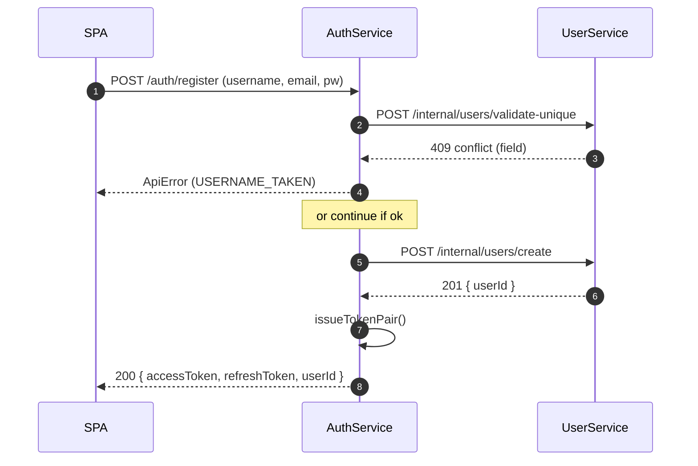

# AuthService – Technical Specification

**Edition v4 – 25 May 2025**
*(v1 → base, v2 → /auth/register, v3 → local schemas, v4 → UserService client & refined contracts)*

---

## 1 Overview

AuthService is a standalone **Fastify** microservice that provides:

* Email/Password authentication (password verification delegated to **UserService**)
* Google OAuth 2.0 login
* JWT access‑ & refresh‑token issuance/validation/rotation
* Optional TOTP‑based 2‑Factor Authentication for email/password logins
* SQLite persistence via **Prisma ORM**
* DTO contracts imported from **@ft‑transcendence/api‑types**
* **Schema validation** via local **AJV** TypeScript schema objects (`src/schemas/*.schema.ts`)

---

## 2 Key Decisions

| Concern            | Decision                                      | Rationale                                         |
|--------------------|-----------------------------------------------|---------------------------------------------------|
| Data ownership     | No `password_hash` column                     | Single credential source in UserService           |
| External OAuth     | Google Sign‑in via **@fastify/oauth2**        | Familiar UX, minimal extra code                   |
| Contracts location | DTOs in **api‑types**, schemas local          | Keeps SRP; each service can swap AJV for Zod etc. |
| ORM                | **Prisma Client + Prisma Migrate**            | Declarative schema, ergonomic API                 |
| DB                 | `auth.db` (SQLite)                            | Lightweight, container‑friendly                   |
| Internal comms     | REST/HTTP on Docker network                   | Aligns with global constraints                    |
| Internal auth      | Shared `X‑Cluster‑Token` header               | Simple and service‑agnostic                       |
| Rate‑limit & CSP   | **@fastify/rate-limit** + **@fastify/helmet** | Adequate for project scope                        |

---

## 3 Endpoint Matrix (public)

| Method | Path                          | Request DTO               | Success Response                            |
|--------|-------------------------------|---------------------------|---------------------------------------------|
| `POST` | `/auth/register`              | `Auth.RegisterRequest`    | `Auth.RegisterResponse` (token pair OR 2FA) |
| `POST` | `/auth/login`                 | `Auth.LoginRequest`       | `Auth.LoginResponse`                        |
| `POST` | `/auth/login/2fa`             | `Auth.Login2FARequest`    | `Auth.LoginSuccess`                         |
| `POST` | `/auth/refresh`               | `Auth.RefreshRequest`     | `Auth.RefreshResponse`                      |
| `POST` | `/auth/logout`                | `Auth.LogoutRequest`      | `Auth.LogoutResponse`                       |
| `POST` | `/auth/2fa/enable`            | –                         | `Auth.TwoFAEnableResponse`                  |
| `POST` | `/auth/2fa/verify`            | `Auth.TwoFAVerifyRequest` | `Auth.TwoFAVerifyResponse`                  |
| `GET`  | `/auth/oauth/google`          | –                         | 302 redirect → Google                       |
| `GET`  | `/auth/oauth/google/callback` | –                         | `Auth.OAuthCallbackResponse`                |

### Internal‑only

| Method | Path                      | Body DTO                  | Purpose                       |
|--------|---------------------------|---------------------------|-------------------------------|
| `POST` | `/internal/tokens/verify` | `Auth.TokenVerifyRequest` | Validate JWT, return `userId` |
| `POST` | `/internal/tokens/revoke` | `Auth.TokenRevokeRequest` | Revoke refresh token by ID    |

All error replies use the unified `ApiError` envelope.

---

## 4 Shared Types & Validation

* **DTO definitions** live in `packages/api-types/src/auth-types.ts` and are imported with:

  ```ts
  import { Auth } from '@ft-transcendence/api-types';
  ```
* **Runtime validation** uses one AJV instance registered by `plugins/validation.ts`.

  ```ts
  app.setValidatorCompiler(({ schema }) => ajv.compile(schema));
  ```

  The plugin auto‑loads every `*.schema.ts` file under `src/schemas` and registers its `default` export (`$id` must be unique).
* **Strict mode** – `additionalProperties: false`, coercion off, built‑in `format` keywords via `ajv-formats`.
* **Error handler** – any thrown `ApiError` passes through the global handler which serialises `{ status:'error', code, message }`.

---

## 5 Database Schema (Prisma)

```prisma
// prisma/schema.prisma

datasource db {
  provider = "sqlite"
  url      = env("DATABASE_URL")
}

generator client {
  provider = "prisma-client-js"
}

model RefreshToken {
  id            String   @id @default(cuid())
  userId        Int
  tokenHash     String
  expiresAt     DateTime
  createdAt     DateTime @default(now())
  rotatedAt     DateTime?
  revoked       Boolean  @default(false)
  revokedReason String?
}

model TotpSecret {
  id        String   @id @default(cuid())
  userId    Int      @unique
  secret    String   // base32
  verified  Boolean  @default(false)
  createdAt DateTime @default(now())
  updatedAt DateTime @updatedAt
}

model OAuthAccount {
  id             String   @id @default(cuid())
  provider       String
  providerUserId String
  email          String
  userId         Int
  createdAt      DateTime @default(now())

  @@unique([provider, providerUserId])
}

model LoginTicket {
  id        String   @id                // UUID v4
  userId    Int
  expiresAt DateTime
  used      Boolean  @default(false)
  createdAt DateTime @default(now())

  @@index([userId])
  @@index([expiresAt])
}
```
---

## 6 AuthService ↔ UserService Internal Contracts

| Purpose                          | HTTP call                              | Payload                           | Success                                  | Error mapping                    |
|----------------------------------|----------------------------------------|-----------------------------------|------------------------------------------|----------------------------------|
| Uniqueness check before register | `POST /internal/users/validate-unique` | `{ username, email }`             | `{ ok:true }` *or* `{ ok:false, field }` | `USERNAME_TAKEN` / `EMAIL_TAKEN` |
| Password verification            | `POST /internal/users/verify-password` | `{ email, password }`             | `{ userId }`                             | `INVALID_CREDENTIALS`            |
| Find‑or‑create on Google OAuth   | `POST /internal/users/find-or-create`  | `{ email, googleSub, username? }` | `{ userId }`                             | `USERVICE_DOWN` (503)            |

All requests must include header `X‑Cluster‑Token: <CLUSTER_TOKEN>`.

---

## 7 Sequence Diagram (registration path)



(Additional diagrams for login + 2FA and OAuth exist in separate canvas files.)

---

## 8  Migrations & Dev Workflow

| Step               | Command                                                 |
|--------------------|---------------------------------------------------------|
| Edit Prisma models | *edit* `prisma/schema.prisma`                           |
| Create migration   | `npx prisma migrate dev --name <change>`                |
| Generate client    | `npx prisma generate` (auto‑run by migrate)             |
| Reset DB (dev)     | `npm run db:reset` (wrapper for `prisma migrate reset`) |

The Docker build runs `prisma migrate deploy` so containers always start with latest schema.

---

## 9  Environment Variables

| Var                         | Purpose                      | Example                                            |
|-----------------------------|------------------------------|----------------------------------------------------|
| `DATABASE_URL`              | SQLite file path             | `file:./auth.db`                                   |
| `JWT_SECRET`                | HMAC key for access tokens   | *32‑byte base64*                                   |
| `REFRESH_TOKEN_SALT`        | HMAC salt for refresh tokens | *32‑byte base64*                                   |
| `CLUSTER_TOKEN`             | Internal service auth        | `d4c3…`                                            |
| `GOOGLE_CLIENT_ID`/`SECRET` | OAuth creds                  | *from GCP console*                                 |
| `GOOGLE_CALLBACK_URL`       | OAuth redirect URL           | `http://localhost:3000/auth/oauth/google/callback` |

---

## 10  Dependencies

```jsonc
"dependencies": {
  "@fastify/jwt": "^6",
  "@fastify/helmet": "^9",
  "@fastify/rate-limit": "^7",
  "@fastify/oauth2": "^8",
  "@ft-transcendence/api-types": "*",
  "@prisma/client": "^5",
  "ajv": "^8",
  "ajv-formats": "^2",
  "fastify": "^4",
  "speakeasy": "^3"
},
"devDependencies": {
  "prisma": "^5",
  "ts-node-dev": "^3",
  "typescript": "^5",
  "vitest": "^1"
}
```

---

## 11 Local `.env` Setup & Generator

### 11.1 Minimal template

Create `backend/authservice/.env` with **at least** the following variables:

```env
DATABASE_URL=file:./auth.db
JWT_SECRET=<32‑byte‑base64>
REFRESH_TOKEN_SALT=<32‑byte‑base64>
CLUSTER_TOKEN=<hex16>

# Google OAuth
GOOGLE_CLIENT_ID=
GOOGLE_CLIENT_SECRET=
GOOGLE_CALLBACK_URL=http://localhost:3000/auth/oauth/google/callback
```

### 11.2 Automatic generator (script)

Add `scripts/generate-env.sh`:

```bash
#!/usr/bin/env bash
set -euo pipefail
JWT_SECRET=$(openssl rand -base64 32)
REFRESH_TOKEN_SALT=$(openssl rand -base64 32)
CLUSTER_TOKEN=$(openssl rand -hex 16)
cat > backend/authservice/.env <<EOF
DATABASE_URL=file:./auth.db
JWT_SECRET=$JWT_SECRET
REFRESH_TOKEN_SALT=$REFRESH_TOKEN_SALT
CLUSTER_TOKEN=$CLUSTER_TOKEN

# Google OAuth
GOOGLE_CLIENT_ID=
GOOGLE_CLIENT_SECRET=
GOOGLE_CALLBACK_URL=http://localhost:3000/auth/oauth/google/callback
EOF
echo ".env generated — fill in Google creds."
```

Expose via npm:

```jsonc
"scripts": {
  "init:env": "bash scripts/generate-env.sh"
}
```

Run `npm run init:env` once per dev machine.

---

## 12  Google OAuth Setup Guide

1. **Create / select a project** in [https://console.cloud.google.com/](https://console.cloud.google.com/).
2. **OAuth consent screen** → *External* → fill app info, add scopes `openid`, `email`, `profile`.
3. **Credentials → Create OAuth client ID** → *Web application*.
4. Add **Authorized redirect URI**: `http://localhost:3000/auth/oauth/google/callback`.
5. Copy **Client ID** and **Client Secret** into `.env`.
6. Rebuild / restart AuthService.

> For production, create a separate OAuth client and mount a different `.env.prod` file.

---

## 13  Docker Build & Run

### 13.1 CLI build

```bash
# from repo root
docker build -f backend/authservice/Dockerfile -t ft-auth-service:latest .
```

Run:

```bash
docker run --rm -p 3000:3000 --env-file backend/authservice/.env ft-auth-service:latest
```

### 13.2 docker‑compose snippet

```yaml
authservice:
  build:
    context: .
    dockerfile: backend/authservice/Dockerfile
  env_file: backend/authservice/.env
  ports:
    - "3000:3000"
```

> **Why root context?** Dockerfile copies `package.json` from the monorepo root and `packages/api-types/**`—those paths are outside `backend/authservice/`.

---

## 14  Open Questions / Future Work

* **Refresh‑token family trees** (token‑reuse detection) – skipped for MVP.
* **Argon2 vs HMAC** – revisit after security review; add PBKDF benchmarking.
* **Audit logging** – optionally emit auth events to centralized log.
* **Account lockout / brute‑force protection** – consider incremental back‑off.

---

## 15  Changelog

| Date        | Version | Notes                                                                                                    |
|-------------|---------|----------------------------------------------------------------------------------------------------------|
| 25 May 2025 | v4      | Register refactor, `username` uniqueness, login‑ticket model, UserService contracts, spec styling fixes. |
| 24 May 2025 | v3      | Local schemas moved to `src/schemas`, AJV auto‑loader.                                                   |
| 23 May 2025 | v2      | Added `/auth/register` endpoint contracts.                                                               |
| 22 May 2025 | v1      | Initial AuthService spec (login, refresh, OAuth, 2FA).                                                   |
